# Architecture

The grammar's design tier drawn from its own structure: one module per
chapter of the language with its actual rule names, the frontier module
with the scanner's functions, and the aggregate holding the whole map.
The figures are rendered by plantuml-render from these sources on every
inject — the family drawing its own blueprints.

<!-- folio: design --assets assets -->
### System view

#### HLD_TreeSitterPlantuml

_hld · `design/hld/HLD_TreeSitterPlantuml.puml`_

- traces to: `SREQ-00001-1`

### Module overview

#### CL_TreeSitterPlantuml

_cl · `design/lld/grammar/CL_TreeSitterPlantuml.puml`_

- traces to: `REQ-00008-1`
- verified by: `tests/test_round_trip.py` (1)

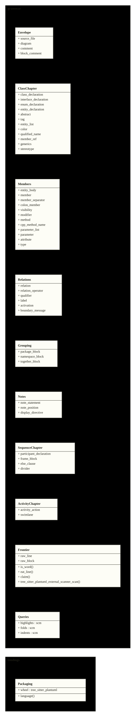

### Class detail

<code>CL_Envelope</code> · traces to <code>REQ-00001-1</code> <code>REQ-00006-1</code>

<ul>
<li>source: <code>design/lld/grammar/CL_Envelope.puml</code></li>
<li>verified by: <code>tests/test_grammar.py</code> (2)</li>
</ul>

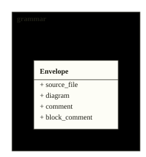

<code>CL_ClassChapter</code> · traces to <code>REQ-00002-2</code> <code>REQ-00014-1</code> <code>REQ-00022-1</code>

<ul>
<li>source: <code>design/lld/grammar/CL_ClassChapter.puml</code></li>
<li>verified by: <code>tests/test_grammar.py</code> (3), <code>tests/test_standard_coverage.py</code> (1)</li>
</ul>

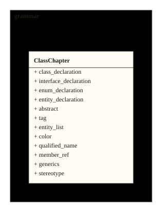

<code>CL_Members</code> · traces to <code>REQ-00003-3</code> <code>REQ-00013-1</code> <code>REQ-00020-1</code> <code>REQ-00023-1</code> <code>REQ-00028-1</code>

<ul>
<li>source: <code>design/lld/grammar/CL_Members.puml</code></li>
<li>verified by: <code>tests/test_grammar.py</code> (4), <code>tests/test_standard_coverage.py</code> (1)</li>
</ul>

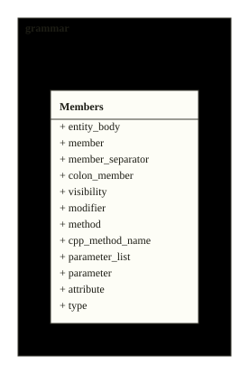

<code>CL_Relations</code> · traces to <code>REQ-00004-1</code> <code>REQ-00021-1</code> <code>REQ-00024-1</code>

<ul>
<li>source: <code>design/lld/grammar/CL_Relations.puml</code></li>
<li>verified by: <code>tests/test_grammar.py</code> (3), <code>tests/test_standard_coverage.py</code> (1)</li>
</ul>

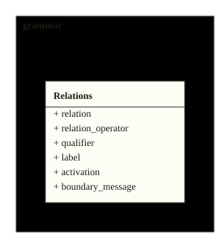

<code>CL_Grouping</code> · traces to <code>REQ-00005-3</code>

<ul>
<li>source: <code>design/lld/grammar/CL_Grouping.puml</code></li>
<li>verified by: <code>tests/test_grammar.py</code> (1)</li>
</ul>

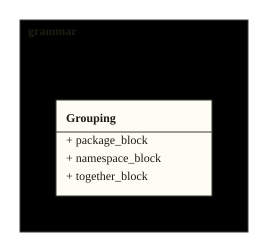

<code>CL_Notes</code> · traces to <code>REQ-00010-4</code> <code>REQ-00011-2</code>

<ul>
<li>source: <code>design/lld/grammar/CL_Notes.puml</code></li>
<li>verified by: <code>tests/test_grammar.py</code> (2)</li>
</ul>

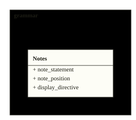

<code>CL_SequenceChapter</code> · traces to <code>REQ-00017-1</code> <code>REQ-00018-1</code> <code>REQ-00019-1</code> <code>REQ-00025-1</code>

<ul>
<li>source: <code>design/lld/grammar/CL_SequenceChapter.puml</code></li>
<li>verified by: <code>tests/test_grammar.py</code> (4), <code>tests/test_standard_coverage.py</code> (1)</li>
</ul>

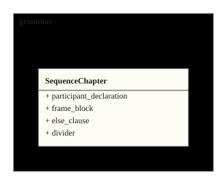

<code>CL_ActivityChapter</code> · traces to <code>REQ-00026-2</code>

<ul>
<li>source: <code>design/lld/grammar/CL_ActivityChapter.puml</code></li>
<li>verified by: <code>tests/test_grammar.py</code> (1), <code>tests/test_standard_coverage.py</code> (2)</li>
</ul>

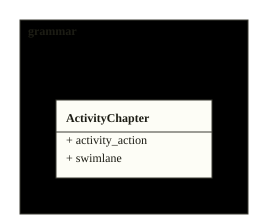

<code>CL_Frontier</code> · traces to <code>REQ-00007-1</code> <code>REQ-00012-2</code>

<ul>
<li>source: <code>design/lld/grammar/CL_Frontier.puml</code></li>
<li>verified by: <code>tests/test_grammar.py</code> (2), <code>tests/test_standard_coverage.py</code> (1)</li>
</ul>

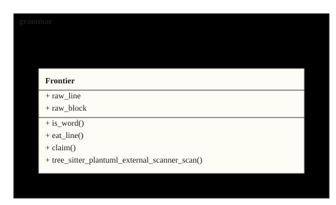

<code>CL_Queries</code> · traces to <code>REQ-00009-1</code> <code>REQ-00027-1</code>

<ul>
<li>source: <code>design/lld/grammar/CL_Queries.puml</code></li>
<li>verified by: <code>tests/test_queries.py</code> (2)</li>
</ul>

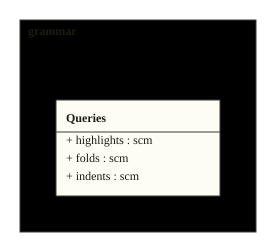

<code>CL_Packaging</code> · traces to <code>REQ-00015-1</code> <code>REQ-00016-1</code>

<ul>
<li>source: <code>design/lld/bindings/CL_Packaging.puml</code></li>
<li>verified by: <code>tests/test_packaging.py</code> (1)</li>
</ul>

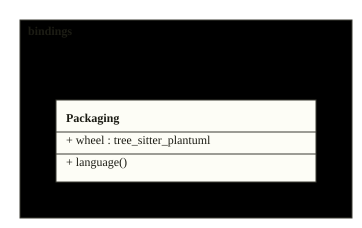

<!-- /folio -->
